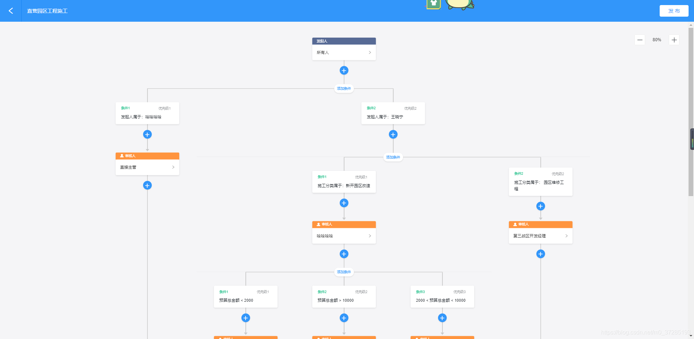

## 项目概述

本项目是一个基于 Activiti 的工作流/审批流（后端），提供流程定义、流程部署、流程实例管理和流程历史查询等功能。系统支持自定义审批流程，同部门审批和抄送任务等特性，适用于企业内部各类审批流程的管理。  

## 项目预览

图源网络，效果一致

## 功能特性

- **流程定义管理**：支持流程的部署、修改、查询和状态管理（激活/挂起）
- **流程实例管理**：支持流程实例的创建、查询和操作
- **流程历史查询**：支持对历史流程的查询和分析
- **JSON定义流程**：详见 `src/script/demo.json`
- **灵活的审批机制**：
  - 支持同部门审批流程
  - 支持条件分支，表单参数
  - 支持抄送任务功能（指定/自选抄送人）
  - 支持自动跳过重复审批人
  - 支持系统预定义流程

## 技术栈

- **基础框架**：Spring Boot 2.7.18
- **工作流引擎**：Activiti 7.0.0.SR1
- **数据库**：MySQL
- **ORM**：MyBatis-Plus 3.5.3.1
- **其他工具**：
  - FastJSON：JSON处理
  - Commons-Lang3：通用工具类

## 数据库配置

创建名为 `workflow` 的数据库，执行 `src/script/init.sql`。  
其他必要的数据表系统将自动创建。
